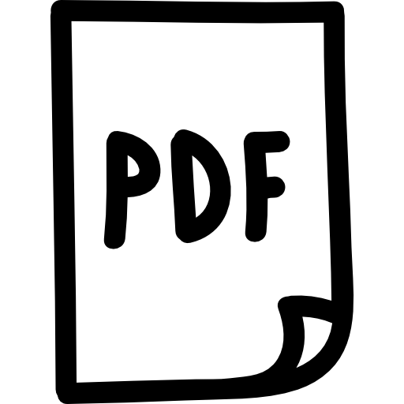

<!-- PROJECT LOGO -->
 

  

  <h3 align="center">pdftotext++</h3>

  

    An extension of <a href="https://github.com/pdftotext-plus-plus/pdftotext-plus-plus">Poppler's pdftotext</a> that converts PDF files to more  accurate plain text and provides many other features you always missed.
     
    <a href="https://pdftotext.cs.uni-freiburg.de"><strong>Explore the docs »</strong></a>
     
     
    <a href="https://pdftotext.cs.uni-freiburg.de">View Demo</a>
    ·
    <a href="https://github.com/pdftotext-plus-plus/pdftotext-plus-plus/issues">Report Bug</a>
    ·
    <a href="https://github.com/pdftotext-plus-plus/pdftotext-plus-plus/issues">Request Feature</a>
  

   

## What's wrong with the classic pdftotext?

Absolutely nothing.

## What are the main features?

* Translation of ligatures and characters with diacritic marks.
* Word Boundary Detection.
* Text Block Boundary Detection.
* Semantic Roles Detection.
* Reading Order Detection.
* Paragraph Detection.
* Word dehyphenation.
* Detection of sub- and superscripts.
* Serialization to different formats (plain text, xml, json, etc.)

## How can I use it?

Describe how to use pdftotext++